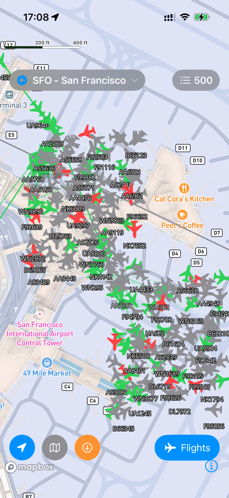

# Overview

A Mapbox SDK demo for airport aircraft dispatch visualization, simulating real-time flight tracking at SFO.



## Features

- Real-time display of 500 aircraft with position and status
- Aircraft move along predefined routes with heading auto-aligned to flight direction
- Route visualization (traveled path + remaining path)
- Tap aircraft to view flight details
- Flight list with filtering and search
- Offline map download support

## Aircraft Status

| Status | Color | Description |
|--------|-------|-------------|
| Approaching | Blue | Inbound flight |
| Taxiing In | Green | Taxiing to gate |
| Parked | Gray | At gate |
| Boarding | Green | Passengers boarding |
| Taxiing Out | Orange | Taxiing for takeoff |
| Delayed | Red | Flight delayed |

## Project Structure

```
Mapbox_tutorial/
├── Models/
│   ├── Aircraft.swift      # Aircraft model + FlightRoute
│   └── Gate.swift          # Gate model
├── Services/
│   └── AircraftSimulator.swift  # Simulates 500 aircraft
├── Map/
│   ├── MapViewController.swift
│   ├── MapViewWrapper.swift
│   └── Extensions/
│       ├── MapViewController+Aircraft.swift  # Aircraft layer
│       └── MapViewController+Gates.swift     # Gate layer
└── Views/
    ├── Aircraft/
    │   └── AircraftPopupView.swift
    └── FlightList/
        ├── FlightListSheet.swift
        └── FlightRowView.swift
```

## Requirements

- Mapbox Maps SDK v11 (SPM)
- iOS 15.0+

## Setup

1. Get an Access Token from Mapbox
2. Add `MBXAccessToken` to `Info.plist`

## Data

All aircraft data is locally simulated. Includes 15 real airport coordinates as origin/destination (LAX, JFK, NRT, etc.). Routes, flight numbers, and statuses are randomly generated for demo purposes.

## License

MIT
